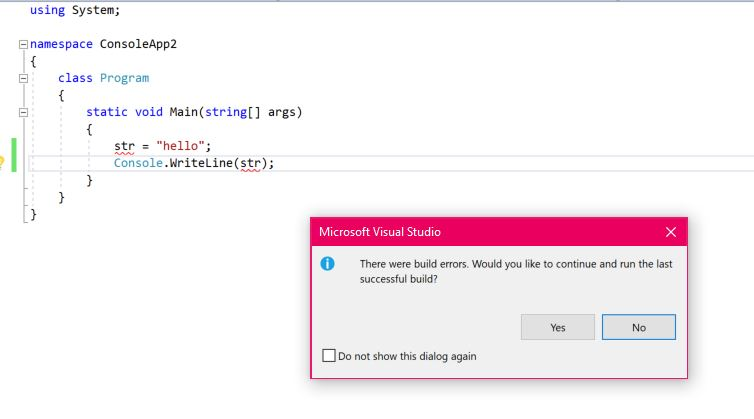

---
title: Intro to TypeScript
...

# Intro to TypeScript

So what is TypeScript you might ask?  It's another thing all the cool kids are using these days, so you'd better wise up and learn this thing too!

All jokes aside, TypeScript is a new way to write JavaScript, and one that is a bit more precise when it comes to declaring variables, functions, classes and more.   

If you've ever used another language like `C#` or `Java`, you know that those languages are a bit more strict about variable declaration.  

While this is okay in JavaScript:
```javascript
str = "Hello World";
console.log(str);
```
It's definitely not in C#:
```csharp
str = "Hello World";
Console.WriteLine(str);
```



This fails in `C#` because we haven't given the variable declared, aka `str` a **type**.  In most programming languages like C#, you need to specify if the variable being declared is of a type of `Integer`, `Float`, `String`, `Boolean`, `Array`, `List` or something else.

A **type** helps the program know what kind of space in memory to allocate for the variable being declared.  In JavaScript, we can get away without declaring a type for the variable, because JavaScript's engine behind the scenes manages our type and memory allocation for us.  

However, in other programming languages, this is not the case -- we need to be specific otherwise we can run into errors later with our program.  

## It's All About Portability

If you're a company like Microsoft, you probably write a lot of C#.  (Windows is a heavy C# language).  Hence, being able to write code in C# and port to JavaScript fast is a dream come true.   Yet, JavaScript doesn't work like C#.  It's got its own rules and quirks developers often have to figure out.  (Functions create objects anyone?)  This causes headaches for many of the developers, and as a result -- TypeScript was created to alleviate some of their pain.

## Do I Need to Learn TypeScript to Be A JavaScript Developer?

At the moment you don't.  Most applications are written in regular JavaScript, and with the new EcmaScript 6 syntax available, you probably don't need to add more complexity to your toolset just yet.   

That said, if you want to be able to use modern JavaScript frameworks like Angular, TypeScript is a requirement.  So it does you some good to learn the syntax eventually.

## Is TypeScript Easy to Learn?

Yes, it's relatively straightforward if you've got a grasp on basic JavaScript fundamentals like being able to declare variables, write and use functions, if/else statements, loops and work with the command line.

## Quick Tutorial

If you want to try out TypeScript right now, the best way to get started is to go to <https://www.typescriptlang.org/> to download the latest version of TypeScript to your computer.  

You can also use Node Package Manager `npm`, if you are a fan of Node.js to download TypeScript, with the command:

```console
npm install -g typescript
```
> This command installs the TypeScript language and compiler globally for your computer.

If all goes well, you should be able to write TypeScript code in your favorite coding editor and use the command line to compile it down to regular JavaScript with the `tsc` command.

### Let's Do An Example Together

After you download TypeScript, open up your favorite editor and let's type in the following code.  

> Note for all my examples, I will be using the latest in JavaScript syntax, aka EcmaScript 6 (ES6).  Not familiar with ES6?  Get my book: [Survive Programming: A RoadMap to EcmaScript 6 - The Latest Version of JavaScript](https://www.amazon.com/Survive-Programming-RoadMap-Version-JavaScript-ebook/dp/B07RXGGQJ5/ref=sr_1_3?keywords=learn+es6&qid=1559086204&s=gateway&sr=8-3)

```js
let myAge: number = 36
let isEmployed: boolean = true
let myName: string = "Vijay is ${myAge} years old and ${ isEmployed : 'is working' : 'is currently broke' }";
```

Save this code in your editor as a TypeScript file, with the extension `.ts`, (so something like myTypeScript.ts).  After that, run the following command in your command line.

```console
tsc myTypeScript.ts
```
If all goes well, you can look at your project folder where your `myTypeScript.ts` file is and see a new file called `myTypeScript.js`.  Congrats! You just compiled your TypeScript code to regular JavaScript code!

```js
var myAge = 36;
var isEmployed = true;
var myName = "Vijay is " + myAge + " years old and " + (isEmployed ? 'is working' : 'is currently broke');
```
You should see this as your output.

### Breaking it Down

Okay, that was cool, but now I'm sure you are wondering what all the `:` stuff means.  Let's break it down.  Remember, JavaScript doesn't have type declarations -- at least explicitly like other languages do.

With TypeScript, we can define what `type` our variable should be with the syntax as follows.

```js
let myAge:number = 36
//this declares a variable of type Number in JavaScript

let isEmployed:boolean = true;
//declares a boolean (true or false variable) in JavaScript

let myName: string = "Vijay is ${myAge} years old and ${ isEmployed : 'is working' : 'is currently broke' }";
//this declares a variable of type String in JavaScript
```

So basically, we declare the `type` of the variable after the variable name has been declared, but before the value is set with the `=` assignment operator.  Using TypeScript is a bit more verbose, but as you can see from the example we did, our declarations do look more precise.  If you're good so far, let's move on.

## Arrays & Tuples
